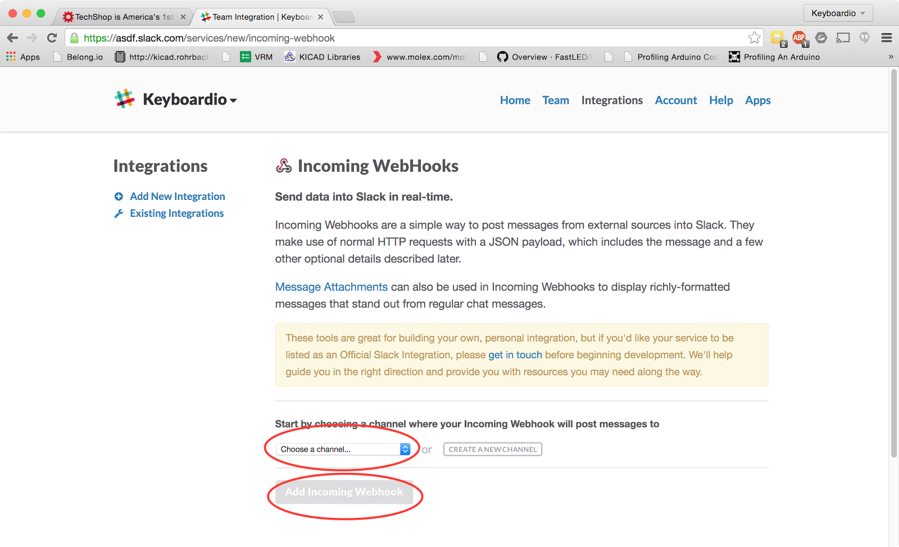
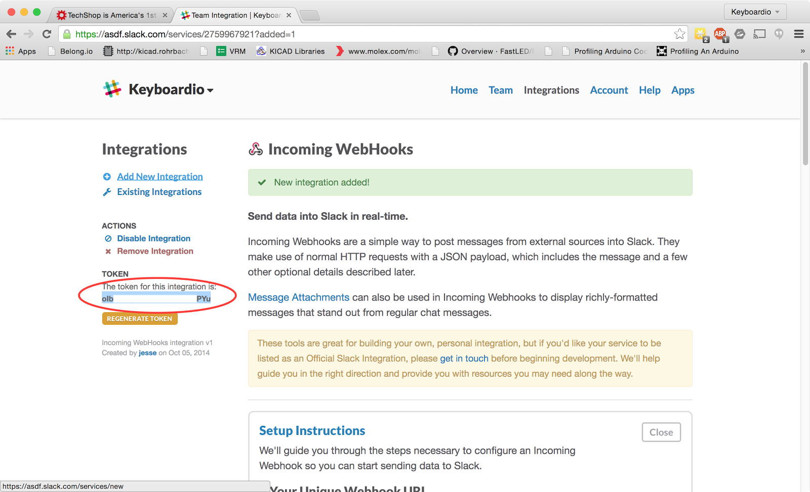
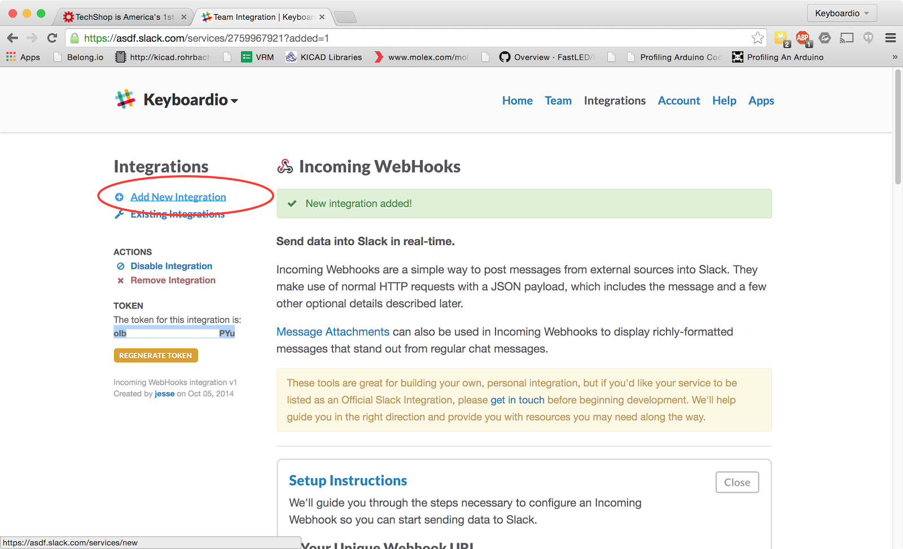
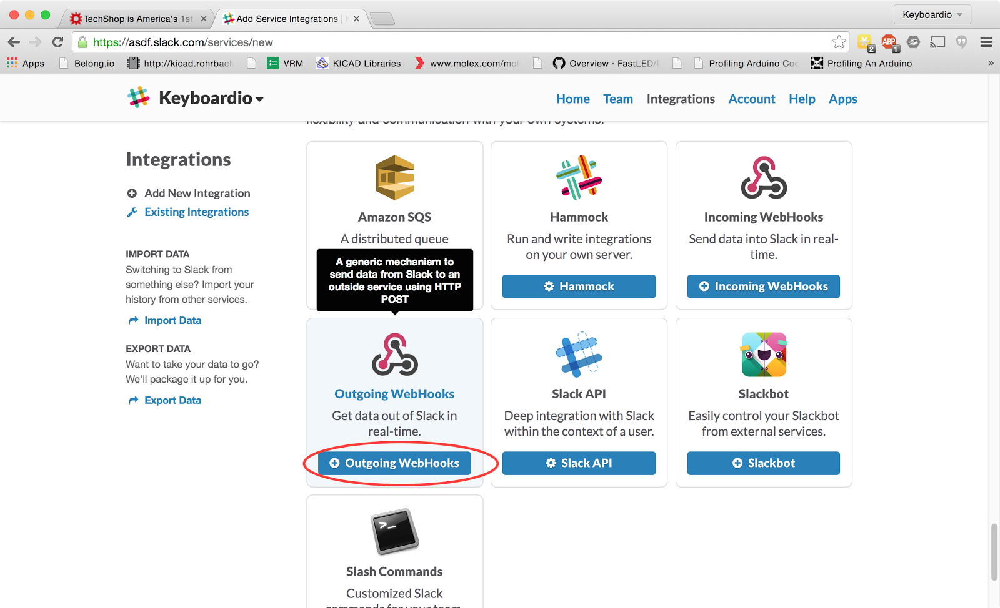
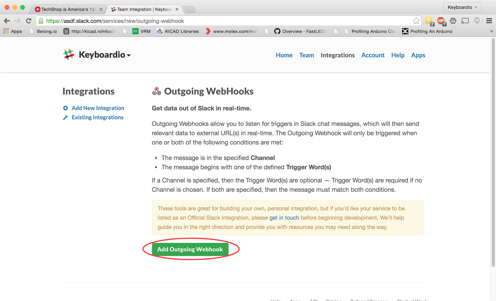

  

To set up a basic cross-slack integration with #slappyhour,
  you need the following

*   A copy of [https://github.com/obra/slappyhour](https://github.com/obra/slappyhour)
    running somewhere. It's a CGI script written in vintage
    1990s-era Perl. It's also all of 40 lines long
*   The ability to set up channels and configure integrations
    on all the Slack instances you want to bridge

On each slack instance, you need to add two integrations: an
  incoming webhook and an outgoing webhook.

Before you begin configuring a Slack Instance to talk to
  #slappyhour, you will need:

*   The URL of your #slappyhour bridge. Ask the person hosting
    the CGI script.

## Adding the incoming webhook

First up, navigate to the integration management IO

Next, click on "Incoming Webhooks" 

Next, pick a channel where all the integration's incoming
  messages should go and click "Add Incoming webhook"

Once you click "add the incoming webhook", you'll see a screen
  that shows you the token for this webhook.

Make a note of this token. You will need to send the token,
  along with the name of your slack instance (xxx.slack.com) and
  your organization's internet domain to the person running your
  #slappyhour bridge.

Next, click "Add a new integration"

This time, you want to set up an outgoing webhook to send
  messages from your channel to the #slappyhour bridge.

Click on Outgoing Webhooks.

Click on "Add Outgoing Webhook"

For Channel, pick the channel you selected for your outgoing
  webhook.

For URLs, fill in the URL of the CGI script provided to you by
  the person running your #slappyhour bridge.

For Label, fill in something that will remind you this is a
  #slappyhour integration.

Click Save Integration

The last configuration step is to notify the person running
  your #slappyhour bridge.

You need to tell them:

Your Incoming Webhook Token

Your Slack Instance's URL (Something like https://asdf.slack.com)

Your organization's internet domain. (Something like example.com)